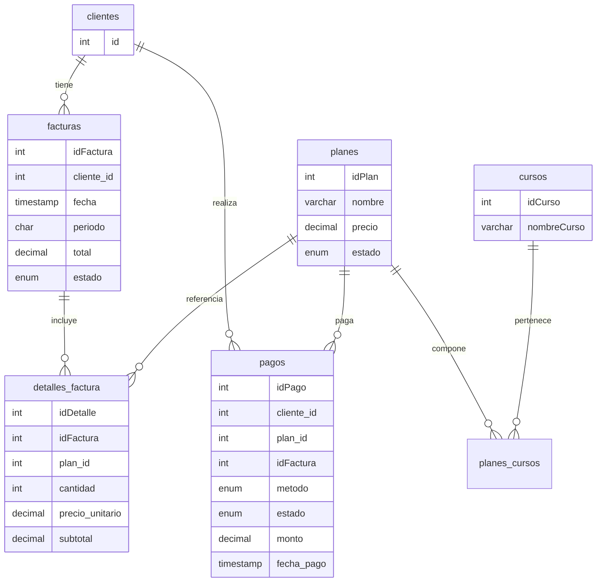

## Documentación de Facturación de Planes (Billing)

### Objetivo y alcance
Implementar facturación de planes mensuales de inglés con registro de pagos, generación automática de facturas y detalle del plan adquirido, y relacionamiento de planes con cursos. Esta actualización modifica únicamente la base de datos y es compatible con el backend/frontend actuales.

### Tablas creadas
- **planes**: catálogo de planes (precio, beneficios, estado).
- **cursos**: catálogo de cursos (A1, A2, B1, etc.).
- **planes_cursos**: tabla puente N:M entre `planes` y `cursos`.
- **facturas**: encabezado de la factura por cliente/periodo.
- **detalles_factura**: línea(s) de la factura; para este caso 1 línea por plan mensual.
- **pagos**: registro de pagos realizados por clientes, enlazados a un plan y a su factura generada automáticamente.

Campos clave por tabla:
- `planes(idPlan, nombre, precio, estado, fecha_actualizacion, beneficios)`
- `cursos(idCurso, nombreCurso, descripcion, duracion, estado)`
- `planes_cursos(idPlan, idCurso)` (PK compuesta)
- `facturas(idFactura, cliente_id, fecha, periodo 'YYYY-MM', total, estado)`
- `detalles_factura(idDetalle, idFactura, plan_id, cantidad, precio_unitario, subtotal)`
- `pagos(idPago, cliente_id, plan_id, idFactura, metodo, referencia, fecha_pago, monto, moneda, estado)`

Relaciones (FK):
- `facturas.cliente_id → clientes.id`
- `detalles_factura.idFactura → facturas.idFactura`
- `detalles_factura.plan_id → planes.idPlan`
- `pagos.cliente_id → clientes.id`
- `pagos.plan_id → planes.idPlan`
- `pagos.idFactura → facturas.idFactura` (SET NULL on delete)
- `planes_cursos.idPlan → planes.idPlan`
- `planes_cursos.idCurso → cursos.idCurso`

### Diagrama ER (referencial)


### Vistas
- `v_planes_cursos`: muestra el catálogo Plan ↔ Cursos.
- `v_facturas_completas`: une `facturas`, `clientes`, `detalles_factura` y `planes` para reporting rápido.

### Lógica de triggers y automatizaciones
1) `trg_pagos_ai_crear_factura` (AFTER INSERT ON pagos)
   - Obtiene el precio actual del plan.
   - Calcula el `periodo` con `DATE_FORMAT(NEW.fecha_pago, '%Y-%m')`.
   - Crea la `factura` con estado `pagado` si el pago llega como `pagado`, si no `pendiente`.
   - Crea el `detalle` con cantidad 1, `precio_unitario` del plan y `subtotal` = cantidad × precio.
   - Actualiza `facturas.total` con la suma de los subtotales.
   - Actualiza `pagos.idFactura` con la factura recién creada.

2) `trg_pagos_au_sincronizar_factura` (AFTER UPDATE ON pagos)
   - Si cambia `pagos.estado`, sincroniza `facturas.estado` (`pagado`/`pendiente`).
   - Si cambia `pagos.plan_id` y la `factura` está `pendiente`:
     - Refresca `detalles_factura` (plan, descripción, precio_unitario, subtotal).
     - Recalcula `facturas.total`.
   - Nota: Si la factura ya está `pagado`, no se actualiza el detalle para mantener integridad histórica.

3) `trg_planes_au_refrescar_pendientes` (AFTER UPDATE ON planes)
   - Si cambia `planes.precio`, actualiza `precio_unitario` y `subtotal` de `detalles_factura` asociados a ese plan en facturas con estado `pendiente`.
   - Recalcula los `total` de esas facturas pendientes.

### Estados
- `facturas.estado`: `pendiente`, `pagado`, `anulado`.
- `pagos.estado`: `pendiente`, `pagado`, `fallido`.

### Comportamiento por escenarios
- Cambio de plan antes del pago (o con factura `pendiente`): se actualiza la línea de detalle y total automáticamente.
- Cambio de plan con factura ya `pagado`: no se cambia la factura por integridad; se recomienda anular y generar un nuevo pago/factura si aplica.
- Cambio de precio del plan: afecta únicamente facturas `pendiente`. Facturas ya `pagado` no se alteran.
- Eliminación de planes/cursos: protegida por FKs (`RESTRICT` o `CASCADE` según corresponda). Eliminaciones de facturas borran sus detalles (`CASCADE`).

### Consultas de reporte útiles
- Clientes por curso (vía Plan ↔ Cursos):
```sql
SELECT c.idCurso, c.nombreCurso, COUNT(DISTINCT f.cliente_id) AS clientes_con_factura
FROM cursos c
JOIN planes_cursos pc ON pc.idCurso = c.idCurso
JOIN planes p ON p.idPlan = pc.idPlan
JOIN detalles_factura df ON df.plan_id = p.idPlan
JOIN facturas f ON f.idFactura = df.idFactura
WHERE f.estado = 'pagado'
GROUP BY c.idCurso, c.nombreCurso
ORDER BY clientes_con_factura DESC;
```

- Ingresos por periodo (YYYY-MM):
```sql
SELECT periodo, SUM(total) AS ingresos
FROM facturas
WHERE estado = 'pagado'
GROUP BY periodo
ORDER BY periodo DESC;
```

- Facturas pendientes por cliente:
```sql
SELECT f.idFactura, f.cliente_id, f.periodo, f.total
FROM facturas f
WHERE f.estado = 'pendiente'
ORDER BY f.fecha DESC;
```

### Despliegue y pruebas
- Ver `database/INSTRUCCIONES_BILLING.md` para pasos de ejecución.
- Pruebas rápidas sugeridas (crear plan/curso, registrar pago, cambiar precio) están incluidas allí.

### Rendimiento e índices
- Índices por FK y campos de filtros comunes: `cliente_id`, `estado`, `periodo`, `plan_id`.
- Uso de `InnoDB` y `utf8mb4` para transacciones e internacionalización.

### Compatibilidad
- No rompe tablas existentes; todo es adicional y con `IF NOT EXISTS`.
- Compatible con MySQL 5.7+ y MariaDB 10.2+.

### Consideraciones futuras
- Posible tabla `suscripciones` si se requiere manejar renovaciones automáticas y periodos de vigencia por cliente.
- Cupones/descuentos implicarían agregar campos en `detalles_factura` o una tabla de descuentos aplicada.


